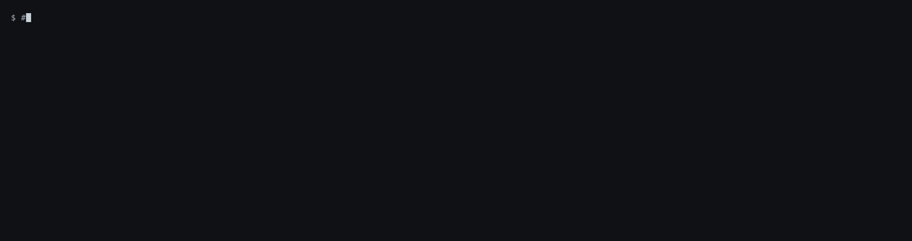
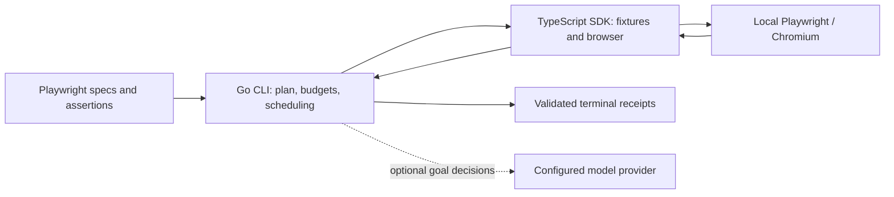

# 9lives runner

[](https://www.npmjs.com/package/@9l/playwright)
[](https://www.npmjs.com/package/@9l/playwright)
[](https://github.com/Quality-Max/9lives-runner/actions/workflows/ci.yml)
[](LICENSE)

Run Playwright tests with bounded execution and attributable receipts. Add
named steps and natural-language goals while keeping explicit assertions as
the test oracle. Local execution needs no QualityMax account or hosted service.

9lives runs, assesses, and stress-tests Playwright tests locally;
[qmax-code](https://github.com/Quality-Max/qmax-code) is the terminal coding and
QA agent that drives broader repository workflows.

[Documentation](docs/README.md) · [Explainer](https://quality-max.github.io/9lives-runner/) ·
[Local demo](demo/README.md) ·
[npm SDK](https://www.npmjs.com/package/@9l/playwright) ·
[CLI releases](https://github.com/Quality-Max/9lives-runner/releases)



Recorded against the repository's synthetic checkout fixture with real
Chromium and no model or account. Assessment is advisory; a passing run proves
the assertions passed, not that they cover the requirements.
See [how it is recorded](demo/README.md#recording).

## Start with an executed result

Install the published SDK in your Playwright project:

```sh
npm install --save-dev @9l/playwright@0.1.2 @playwright/test@1.64.0
npm exec playwright install chromium
```

Use Node 24 for the qualified runtime (Node 22 minimum) and Playwright 1.61.1
through 1.64.0; an existing project can keep its version in that range. On Linux, use
`npm exec playwright install --with-deps chromium` for browser dependencies.

Install the Go CLI separately. With Go 1.25.13 or newer:

```sh
go install github.com/Quality-Max/9lives-runner/cmd/9l@latest
9l --version
```

Ensure Go's binary directory is on your `PATH`. Prebuilt CLI releases target
macOS and Linux on amd64 and arm64, so their users do not need Go. See the
[download and checksum instructions](docs/install.md) for availability and
platform selection. Windows amd64 and arm64 ZIPs are added by this source
revision for the next CLI release; published v0.1.5 has macOS/Linux assets only.
The npm package supplies the fixtures; it does not install
the CLI or browsers.

### Run a test

Keep your application's existing Playwright configuration and reviewed
assertions. For an application serving a checkout page:

```ts
import {test, expect} from '@9l/playwright';

test('checkout confirms an order', async ({page, n9l}) => {
  await page.goto('http://localhost:3000/checkout');
  await n9l.step('place the order', async () => {
    await page.getByRole('button', {name: 'Place order'}).click();
    await expect(page.getByRole('status')).toHaveText('Order confirmed');
  });
});
```

Start the application, then run from the test project:

```sh
9l run tests/checkout.spec.ts --sdk --format json
```

For a complete runnable example that needs no application server or model,
clone this repository and follow the [local checkout demo](demo/README.md).
For an existing application, see the [integration guide](docs/run-existing-project.md).

### What the result establishes

The runner records a terminal outcome for every required test and validates
SDK evidence against the owning run, job and attempt. Required failures,
missing evidence, unexplained skips and interruption prevent an overall green
result. Receipts persist under `.9lives/receipts/`; inspect them with
`9l result <run-id> --format json`.

A passing execution means the test's assertions passed and its report was
validated. It does not prove that the assertions fully cover the requirements.
Independent behavioral verification remains planned.

## What you can do

| Capability | Available behavior | Boundary |
| --- | --- | --- |
| Plan and run | Discover specs, inspect plans, bound concurrency and deadlines | Runs locally installed Playwright; no automatic tooling downloads |
| Inspect and cancel | `status`, `result`, `cancel`, and terminal receipts | Interrupted runs are classified; automatic crash recovery is planned |
| SDK steps | `n9l.step(...)` with normal browser fixtures and assertions | Opt in with `--sdk`; existing execution stays available separately |
| Visual mode | `run --headed` shows the browser, one job at a time by default | Linux needs a display (`xvfb-run -a` on headless machines); slow motion comes from the project's `launchOptions` |
| Bounded goals | `n9l.goal(...)` over finite observed controls | Completion is unverified; live model accuracy and cost are unqualified |
| Test assessment | `assess` and source/branch provenance | Advisory static review; it does not establish executed assertion coverage |
| Fault proof | Experimental `prove`: re-run a spec once per injected fetch/XHR fault and report which an assertion caught | Needs `@9l/playwright` 0.1.1; a caught fault shows an assertion failed, not that it checks the right thing |
| Healing | Offline Tier 1 proposals and experimental native Tier 2 verification | Preserve assertions; verify candidates in isolation before application |

See the [CLI reference](docs/cli.md), [assessment guide](docs/test-assessment.md), [prove](docs/prove.md),
[native Tier 1](docs/native-tier1.md) and [native Tier 2](docs/native-tier2.md).
Verified replay and native mobile qualification remain subsequent milestones.
Windows process ownership uses kill-on-close Job Objects; native Windows
amd64 and arm64 CI checks Chromium execution and process-tree cleanup.
Provider CLI shell integrations on Windows remain unqualified.

### Add a bounded goal

```ts
await n9l.goal('Fill Name using name, then click Continue.', {
  params: {name: 'Fixture Person'}, maxActions: 3, timeoutMs: 30_000,
});
await expect(page.getByRole('heading', {name: 'Review'})).toBeVisible();
```

Choose `--goal-provider anthropic` or `openai` and configure its credential
securely in Go's calling environment. Offline `--goal-script` fixtures exercise
the browser/engine contract without paid API calls. Purchase, deletion and
outreach controls stop by default. See [goal contracts](docs/goals.md).

## Compatibility

| Component | Qualified | Boundary |
| --- | --- | --- |
| `@playwright/test` | 1.61.1, 1.62.0, 1.62.1, 1.63.0, 1.64.0 | CI runs the unit, browser, assessment and packed-SDK checks on each. Later 1.x releases install (peer range `>=1.61.1 <2`) but are unqualified |
| `9l assess` matchers | Playwright 1.61.1 through 1.64.0 | The async matchers are identical across that range. A matcher outside it is reported as an `unknown-matcher` limit, not guessed |
| Browser | Chromium | Other engines are unqualified |
| Node | 24 (22 minimum) | |
| CLI | 0.1.5 on macOS and Linux, amd64 and arm64 | Windows is not declared |
| SDK | `@9l/playwright` 0.1.2 | Installing the SDK does not install the CLI or browsers |

Keep your project's existing Playwright version if it is in the qualified
range; upgrading is not required. To check a release locally, see the
[development guide](docs/development.md).

## Add it to your coding agent

The optional [9lives QA skill](skills/9lives-qa/SKILL.md) guides Codex and Claude
through requirements, source provenance, assessment and executed results.
Use the [agent setup guide](docs/agent-setup.md) to add it to a project.

## Adjacent QualityMax tools

| Tool | Use it for |
| --- | --- |
| [qmax-mcp](https://github.com/Quality-Max/qmax-mcp) | Browser scanning, page inspection and focused Playwright reproductions |
| [9lives Python](https://github.com/Quality-Max/9lives) | Python-only healing options, Cypress/Selenium adapters and watch/report commands |

These are separate distributions. Installing this runner or SDK does not
install or configure them. The Python package also provides a `9l` command;
use an explicit executable path when both CLIs are installed.

## Safety and honest limits

Test code executes with the local user's permissions. Use approved targets
and explicitly pass required application environment keys with `--pass-env`.
Goal parameter values stay in the browser worker; provider credentials stay
in Go. Receipts omit page content and attachment bodies by default, and bound
and sanitize diagnostics. Review the [SDK evidence contract](docs/sdk-bridge.md)
for identity, privacy, skip pins and failure handling.

## Architecture



Go owns execution identity, cancellation and completeness. TypeScript owns
browser handles and fixtures. The bounded `9l.engine/1` protocol joins them.
See [architecture decisions](docs/architecture.md) and the
[performance baseline](benchmarks/BASELINE.md), which separates runner overhead
from Playwright and browser costs.

## Support and responsible disclosure

Use [GitHub Issues](https://github.com/Quality-Max/9lives-runner/issues) for
non-sensitive usage and documentation questions. Report vulnerabilities
privately using the [security policy](SECURITY.md).

## Development

```sh
npm ci
npm exec playwright install chromium
npm run demo
go test -race ./...
go vet ./...
```

The [development guide](docs/development.md) lists SDK qualification, pinned
Python compatibility checks and repository boundaries.
See [contributing](CONTRIBUTING.md) before proposing changes.

## Package and release metadata

The published [@9l/playwright 0.1.2](https://www.npmjs.com/package/@9l/playwright)
and the Go CLI are separate distributions. SDK releases use `sdk-v<version>`;
CLI releases use `v<version>`. Binary archives include `LICENSE`, `NOTICE` and
release-wide SHA-256 checksums. See the [release runbook](docs/releases.md)
and [changelog](CHANGELOG.md).

## License

[Apache-2.0](LICENSE). Third-party components retain their own licenses and
notices. The SDK package and CLI archives include `LICENSE` and `NOTICE`.
